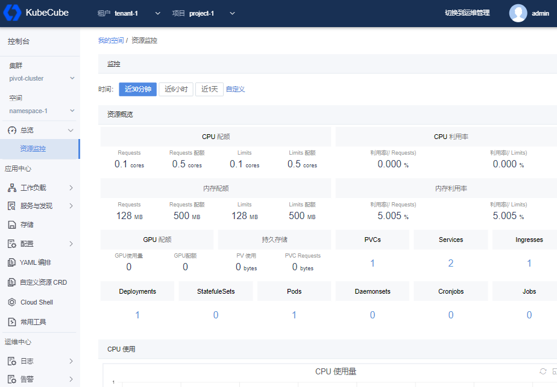
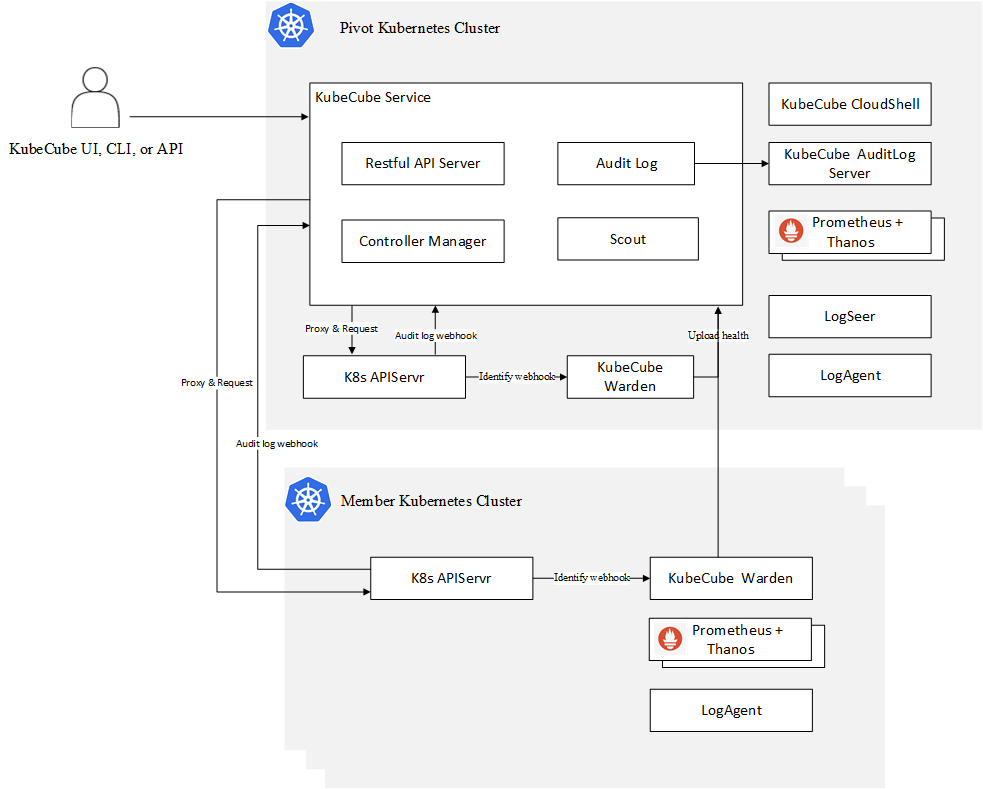

# KubeCube

[](https://https://github.com/kubecube-io/kubecube/blob/main/LICENSE)  [](https://github.com/kubecube-io/KubeCube/actions/workflows/build.yml)


> English | [中文文档](./docs/README-zh_CN.md)

KubeCube is an open source enterprise-level container platform that provides enterprises with visualized management of Kubernetes resources and unified multi-cluster-multi-tenant management functions. KubeCube can simplify application deployment, manage application life cycles and provide rich monitoring and log auditing functions, helping companies quickly build a powerful and feature-rich container cloud platform.



## Features

- **Out of the box**
  - The learning curve is gentle, integrating functions such as unified authentication, multi-cluster management, monitoring, logs, and alarms to release productivity
  - Operation friendly, providing visual management and unified operation of Kubernetes resources, with comprehensive self-monitoring capabilities
  - Quick deployment, providing [All in One](https://www.kubecube.io/docs/quick-start/installation/) Minimized deployment mode and providing High Availability Deployment for production

- **Multi-tenant**
  
  - Provide multi-level models of tenants, projects, and spaces to meet the needs of enterprise resource isolation and software project management
  - Based on the multi-tenant model, provide permissions control, resource sharing/isolation and other capabilities
  
- **Unified [Multi Kubernetes Cluster Management](https://www.kubecube.io/docs/user-guide/administration/k8s-cluster/multi-k8s-cluster-mgr/)**
  - Provides a central management panel for multiple Kubernetes clusters and supports cluster import
  - Provide unified identity authentication and expand Kubernetes native RBAC capabilities in multiple Kubernetes clusters [Access Control](https://www.kubecube.io/docs/user-guide/administration/role/)
  - Quickly manage cluster resources through WebConsole and CloudShell

- **Cluster autonomy**
  - When the KubeCube service is down for maintenance, each business cluster can service well, still support access control, and transparent to business Pods

- **[Hot Plug](https://www.kubecube.io/docs/installation-guide/enable-plugins/)**
  - Provide minimal installation, users can switch functions at any time according to their needs
  - There is not need to restart the KubeCube service, while switching the function.

- **Multi-access**
  - Support [Open API](https://www.kubecube.io/docs/developer-guide/openapi-guide/): It is convenient to connect to users’ existing systems
  - Compatible with Kubernetes native API: seamlessly compatible with existing Kubernetes tool chains, such as kubectl
- **No vendor lock-in**
  - Any standard Kubernetes cluster can be imported to better support multi-cloud and hybrid-cloud

- **Others**

  - [Operation Audit](https://www.kubecube.io/docs/user-guide/administration/audit/)
  - Abundant observability functions

  

## What it does

- **Helping enterprise build the container platform**

  Simplify the learning curve, help companies complete the construction of container platforms at a relatively low cost, realize the needs of rapid application deployment, and assist companies in promoting applications to the cloud.

- **Resource isolation, quota, and RBAC**

  Multi-tenant management provides three levels of resource isolation, quota management, and RBAC for tenants, projects, and spaces, fully adapting to the resource and RBAC requirements of enterprise-level private cloud construction.

- **Cluster horizontal expansion**

  A unified container cloud management platform can manage multiple business Kubernetes clusters, and there is no upper limit on the number. It can not only solve the limitation of the size of a single Kubernetes cluster by adding a new Kubernetes cluster through horizontal expansion, but also meet the requirements of different business lines to monopolize the cluster.

- **Rich observability**

  Supports monitoring alarms and log collection in the cluster dimension and application dimension, provides a rich workload monitoring indicator interface and a cluster dimension monitoring interface, and provides flexible log query capabilities.

## Architecture

The KubeCube is composed of components such as KubeCube Service, Warden, CloudShell, and AuditLog Server. Except for Warden, which is deployed in each Kubernetes cluster as an authentication agent, the rest of the components are deployed in the management cluster.

The architecture of KubeCube described in the figure below includes interaction with users, interaction with Kubernetes API Server, Prometheus monitoring and self-developed log collection components.



## Quick Start

1、[Environment Requirements](https://www.kubecube.io/docs/installation-guide/requirement/)

2、[All In One](https://www.kubecube.io/docs/quick-start/installation/)

3、[Quick Experience](https://www.kubecube.io/docs/quick-start/quick-experience/)

## For Developers

[Contribution](https://www.kubecube.io/docs/developer-guide/contributing/)

## Feedback & Contact

[FAQ](https://www.kubecube.io/docs/faq/)

## License

```
Copyright 2021 KubeCube Authors

Licensed under the Apache License, Version 2.0 (the "License");
you may not use this file except in compliance with the License.
You may obtain a copy of the License at

    http://www.apache.org/licenses/LICENSE-2.0

Unless required by applicable law or agreed to in writing, software
distributed under the License is distributed on an "AS IS" BASIS,
WITHOUT WARRANTIES OR CONDITIONS OF ANY KIND, either express or implied.
See the License for the specific language governing permissions and
limitations under the License.
```